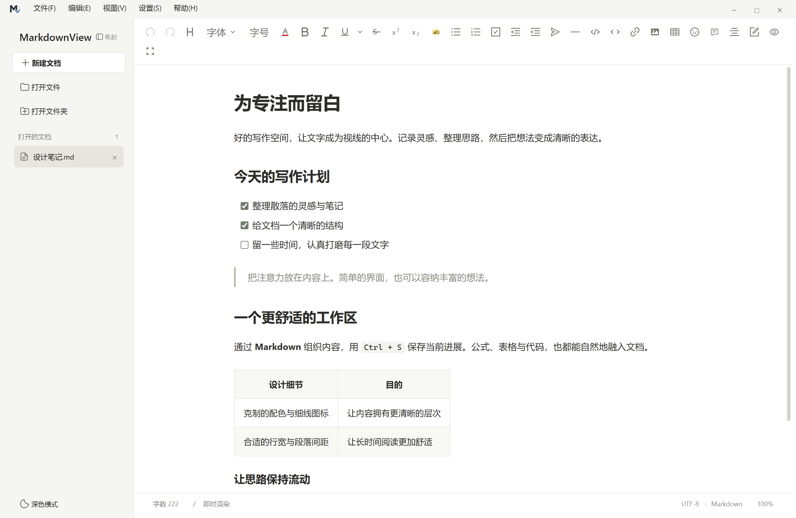
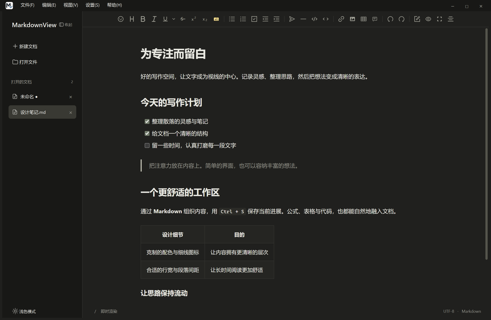

# MarkdownView

一款面向 Windows 的桌面 Markdown 编辑器，让笔记、公式与长文写作保持专注。

基于 **Python + PySide6 / Qt WebEngine + Vditor + KaTeX**，支持即时渲染、多文档、批注、草稿恢复、模型翻译，以及 Word / PDF 导出。

**当前源码版本：1.3.0 · 2026-10-07 更新。** 仓库保留应用源码、运行资源、构建配置及说明文档；测试脚本仅在本地维护，不上传 EXE 或安装包。可以按下文从源码运行。

- **局部文字格式**：选中一句或一段，修改字体、字号和文字颜色，保存及 Word / PDF 导出保留格式。
- **表格编辑**：自定行列数，右键插入／删除行列，选中或删除整张表格。
- **页内翻译**：右侧栏实时显示，全文左右对照与同步滚动；支持 30 种语言及自定义语言、开始／停止／继续翻译。
- **手动增量翻译**：编辑原文后点击“更新改动”，仅翻译修改句段并复用其余译文；支持自定义专业提示词与术语表。
- **翻译阅读位置修复**：流式更新及每段翻译完成后保留阅读位置，避免原文和译文一起跳回开头；手动滚动仍优先响应。
- **修复与优化**：修复图片迁移、翻译引用保护及输入法误触，减少批注重复定位和后台扫描；47 个本地源码回归脚本最终通过。

详见 [功能与使用说明](docs/features-1.2.md)、[本轮检查报告](docs/validation-2026-10-07.md)及[资源实测](docs/resource-optimization.md)。



## 功能亮点

| 功能 | 说明 |
| --- | --- |
| 三种编辑模式 | 即时渲染（IR）、所见即所得和源代码模式，支持大纲与预览 |
| 多文档工作区 | 侧栏切换、关闭、拖拽排序，拖出文档可分离为独立窗口 |
| 项目文件夹 | 按需加载文件树，打开 Markdown / TXT，自动跟踪文件变化并恢复项目 |
| 正文缩放 | 每份文档独立保持 50%–300% 显示比例，工具栏与面板保持固定大小 |
| 文件读取保护 | 不支持、编码无效或读取失败的文件显示只读提示，修复后可重试 |
| 数学与表格 | KaTeX 渲染 LaTeX 公式；自定义表格行列数，右键增删行列、选中或删除整表，支持撤销 |
| 图片插入 | 选择图片、粘贴截图、拖入多张图片；保存时管理相对路径资源 |
| 丰富格式 | 选中文字设置字体、字号与文字颜色，保存及 Word / PDF 导出保留格式；多种下划线、上下标、删除线及彩色高亮 |
| 查找替换 | 大小写、整词匹配、匹配数量、单次与全部替换 |
| 批注与统计 | 选区批注、定位原文，查看全文及选中文字、字符和行数 |
| 草稿保护 | 后台草稿备份、异常退出恢复、可选自动保存与外部修改检测 |
| 会话恢复 | 最近文档、上次工作区和阅读位置恢复 |
| Word / PDF 导出 | DOCX 保留 Word 原生公式和表格；PDF 用于阅读、打印与分享 |
| 主题与语言 | 浅色 / 深色主题，简体中文 / English 界面，偏好跨窗口同步 |
| 本地编辑 | 编辑器与公式资源随源码提供，基本编辑与公式渲染无需联网 |
| 模型翻译 | Chat Completions / Responses / Anthropic Messages，支持 HTTP / HTTPS；选区 / 全文、多语言、流式预览、取消与续译、Markdown 保护 |
| 专业提示词 | 通用、学术、技术文档、商务及自然表达预设；支持修改、新增、保存及术语表 |
| 阅读与专注 | 字体、字号、行距、段距和行宽设置；只读、专注写作及大文档轻量模式 |
| 项目效率 | 全文搜索、快速打开、命令面板、右键新建 / 重命名 / 移动、恢复最近关闭文档 |
| 版本与模板 | 外部修改对比、有限历史快照、恢复为新文档、文档模板与常用片段 |
| 输出与分享 | PDF 纸张 / 方向 / 页边距 / 页码 / 目录，Word 样式模板，图片压缩、检查与 ZIP 打包 |

再次打开 Markdown 文件时，会交给已运行的窗口；重复打开同一文件会切换到已有文档，并保留未保存内容。

<details>
<summary>查看深色界面</summary>



</details>

## 从源码运行

当前主要开发与验证环境为 **Windows、Python 3.12**。项目包含 Windows 专用的窗口与安装逻辑，其他平台尚未验证。

在 PowerShell 中执行：

```powershell
git clone https://github.com/Mryang-wang/MarkdownView.git
cd MarkdownView

python -m venv .venv
.\.venv\Scripts\python.exe -m pip install -r requirements.txt

.\.venv\Scripts\python.exe main.py
```

无需激活虚拟环境，直接使用其中的 Python 即可。也可以指定要打开的文件：

```powershell
.\.venv\Scripts\python.exe main.py "D:\Notes\我的笔记.md"
```

首次运行显示空白文档；后续不带参数启动时，默认恢复上次会话。Vditor 与 KaTeX 资源已经包含在 `app/assets/vditor/`，无需另外执行 npm 安装。

### 启用 Word 导出

DOCX 导出需要安装 Pandoc；建议使用 3.x 或更新版本：

```powershell
winget install --id JohnMacFarlane.Pandoc --exact
```

程序会检测 PATH 和 WinGet 的 Pandoc 安装位置。PDF 导出使用 Qt WebEngine，无需额外安装 LaTeX。

### 配置翻译

1. 打开 **设置 → 翻译模型设置**，选择 `OpenAI Chat Completions`、`OpenAI Responses` 或 `Anthropic Messages`。
2. 填写自己的服务地址、模型名称和 API Key，测试连接后保存。支持本机或远程的 HTTP / HTTPS 服务。
3. 选中文字后右键“翻译选中内容”，译文显示在右侧；通过 **编辑 → 全文翻译模式** 打开全文对照阅读。
4. 从“从／译为”下拉框选择语言，可编辑预设提示词或保存自己的专业提示词。原文修改后点击“更新改动”，输入时不会自动发送翻译请求。

翻译会将选定内容及必要的相邻上下文发送到你配置的服务，费用由该服务收取。基本编辑与本地导出不需要模型。API Key 可仅在本次运行中使用，或通过 Windows 当前账户加密保存在本地；仓库不包含密钥或内置模型。

<details>
<summary>查看全文对照翻译界面</summary>


截图使用本地模拟服务的示例文档，用于展示界面，不代表真实模型翻译质量。

</details>

## 常用快捷键

| 快捷键 | 功能 |
| --- | --- |
| `Ctrl+T` | 新建文档 |
| `Ctrl+O` | 打开文档，可多选 |
| `Ctrl+Shift+O` | 打开项目文件夹 |
| `Ctrl+S` / `Ctrl+Shift+S` | 保存 / 另存为 |
| `Ctrl+W` | 关闭当前文档 |
| `Ctrl+F` / `Ctrl+H` | 查找 / 替换 |
| `F3` / `Shift+F3` | 下一个 / 上一个匹配 |
| `Ctrl+V` | 粘贴文字或截图 |
| `Ctrl+Alt+M` | 为选中文字添加批注 |
| `Ctrl+Alt+T` | 翻译选中文字 |
| `Ctrl+Alt+Shift+T` | 全文翻译模式 |
| `Ctrl+P` / `Ctrl+Shift+F` | 快速打开 / 项目全文搜索 |
| `Ctrl+Shift+P` | 命令面板 |
| `Ctrl+Shift+T` | 恢复最近关闭的文档 |
| `Ctrl+Shift+R` / `Ctrl+Shift+Enter` | 只读阅读 / 专注写作 |
| `Ctrl+E` | 导出 DOCX |
| `Ctrl+Shift+E` | 导出 PDF |
| `Ctrl+\` | 显示或隐藏侧栏 |
| `Ctrl+Shift+L` | 切换深浅主题 |
| `Ctrl++` / `Ctrl+=`、`Ctrl+-` | 放大 / 缩小页面显示比例 |
| `Ctrl+0` | 恢复页面显示比例为 100% |
| `Ctrl+鼠标滚轮` | 调整页面显示比例 |
| `Ctrl+'` | 切换全屏，`Esc` 退出 |
| `Ctrl+左键` | 打开正文中的链接 |

## 文档与导出说明

### 公式

支持 `\(...\)` 行内公式，以及 `$$...$$`、`\[...\]` 行间公式。加载时会转换为编辑内核使用的分隔符；保存时行内 `$...$` 会转换为 `\(...\)`，代码块和行内代码不参与转换。

注意：如果货币文本中的 `$` 被识别为公式，保存时也可能发生上述转换。建议对字面量美元符号使用 Markdown 转义。

DOCX 导出通过 Pandoc 将公式转换为 Word 原生 OMML 对象，将表格转换为原生表格。包含针对部分跨行定界符的兼容预处理；`\tag{n}` 在 Word 中显示为公式末尾的编号文本。复杂公式仍建议在 Word / WPS 中检查导出结果。

### 图片与格式

- 选中文字后使用顶部“字体”“字号”或带色条的 **A** 设置局部格式。字体来自电脑已安装字体；字号支持 **6–96 磅**、0.5 磅微调；字色支持预设、选色器和十六进制输入，可恢复正文样式或自动颜色。
- 局部字体、字号和字色以 HTML `span` 样式保存，支持撤销／重做，Word 导出写入可编辑格式。其他 Markdown 阅读器的显示取决于其 HTML/CSS 支持；其他电脑查看相同字体需要安装对应字体。
- 插入表格时可设置 **1–100 行（含表头）、1–50 列**。即时渲染和所见即所得模式下，右键单元格可增删行列、选中或删除整表。
- 本地插入、粘贴和拖入的图片由程序管理；未命名文档的图片先暂存，保存或另存为时复制到目标文档旁的 `images/` 目录。分享文档时请同时带上图片目录。
- 下划线使用 `<u>` 标签，非单线样式通过 `text-decoration-style` 保存；彩色高亮使用带颜色的 `<mark>` 标签。DOCX 导出保留下划线线型和自定义 RGB 底色。
- 上下标使用 `^文本^` / `~文本~`，不同 Markdown 阅读器对这些扩展语法的支持可能不同。

### 批注与草稿

- 批注以带版本标记的 HTML 注释保存在 Markdown 文件尾部，随文件一起移动；其他阅读器的源码视图可能看到批注数据。
- DOCX / PDF 导出包含正文，不导出本软件的批注面板和批注数据。
- 草稿与会话存放在 Qt 应用本地数据目录中；主动放弃修改会清理相应恢复备份。
- 自动保存为可选功能；检测到磁盘上的文件被外部修改时会暂停自动保存并保留草稿。

详细操作见 [选区统计、批注与界面语言](docs/review-and-language.md)。多文档按需加载、内存缓存策略及实测限制见 [资源实测与优化说明](docs/resource-optimization.md)。

## 构建 Windows 安装包

安装脚本当前版本为 **1.3.0**，目标为 **Windows 10 1809 或更新版本的 x64 兼容环境**。以下供自行构建使用；本次源码更新未重新打包或发布 EXE。

先完成上述依赖与 Pandoc 安装，再安装 **Inno Setup 6**。在项目根目录执行：

```powershell
.\.venv\Scripts\python.exe -m pip install pyinstaller
.\.venv\Scripts\python.exe -m PyInstaller --noconfirm --clean --distpath dist/release-1.3.0 --workpath build/release-1.3.0 MarkdownView.spec

# 如安装位置不同，请替换为实际的 ISCC.exe 路径
& "$env:LOCALAPPDATA\Programs\Inno Setup 6\ISCC.exe" installer/MarkdownView.iss
```

产物为 `dist/setup.exe`。安装包包含 Python、Qt、编辑器资源及 Pandoc，最终用户无需另外配置这些依赖。安装器注册 `.md`、`.markdown` 的打开方式，默认应用需在 Windows 设置中选择。

仓库提供源码与构建脚本，`dist/` 中的本地安装包不纳入 Git。修改版本号时，请同步检查安装脚本、`installer/version_info.txt` 与构建目录。

## 项目结构

```text
MarkdownView/
├── main.py                   # 应用入口与单实例文件转交
├── app/
│   ├── main_window.py         # 主窗口、文档与编辑器管理
│   ├── bridge.py              # Python / JavaScript 通信
│   ├── exporter.py            # Pandoc 调用与 DOCX 预处理
│   ├── workspace_store.py     # 工作区、会话与草稿管理
│   ├── workspace_features.py  # 搜索、历史、模板、文件与阅读工具
│   ├── document_services.py   # 图片迁移、ZIP、历史存储与后台扫描
│   ├── translation.py         # 三种模型协议、流式请求与密钥保存
│   ├── translation_panel.py   # 翻译侧栏及全文翻译协调
│   ├── translation_markdown.py # Markdown 保护与翻译分批
│   ├── translation_memory.py # 句段缓存及手动增量更新
│   ├── single_instance.py     # 单实例通信
│   ├── project_explorer.py    # 项目文件树与磁盘变化跟踪
│   ├── file_notice.py         # 无法读取文件时的只读提示
│   ├── i18n.py                # 界面翻译
│   └── assets/                # HTML、CSS、脚本与本地 Vditor 资源
├── docs/                      # 功能说明、性能记录与界面截图
├── design/app-icon/           # 图标源素材和各尺寸资源
├── installer/                 # Inno Setup 脚本、语言与版本资源
├── tools/                     # 图标生成工具
├── MarkdownView.spec         # PyInstaller 构建配置
└── requirements.txt          # Python 运行依赖
```

## 验证与仓库范围

测试、性能基准及安装验证脚本保留在维护者本地，已从公开仓库移除并加入忽略规则。应用运行和构建不依赖这些脚本；私人样本、测试输出、虚拟环境及打包产物也不纳入仓库。

2026-10-07 字体与功能检查阶段，本地 **47 个源码回归脚本**最终通过，涵盖编辑、翻译、表格、导出、窗口和资源回收。随后针对翻译跳回开头的问题，**6 个相关回归脚本**通过，覆盖分段完成、流式显示、同步滚动、增量更新和语言切换。翻译协议使用本地模拟 HTTP/SSE 服务。

测试范围、修复清单及实测限制见 [检查报告](docs/validation-2026-10-07.md)。文档中的脚本名称与日志路径用于记录本地验证过程，下载源码后不包含这些文件。

## 反馈

欢迎通过 [Issues](https://github.com/Mryang-wang/MarkdownView/issues) 反馈问题。请提供 Windows / Python / PySide6 版本、复现步骤和不含私人内容的最小 Markdown 示例；导出问题请附 Pandoc 版本。
