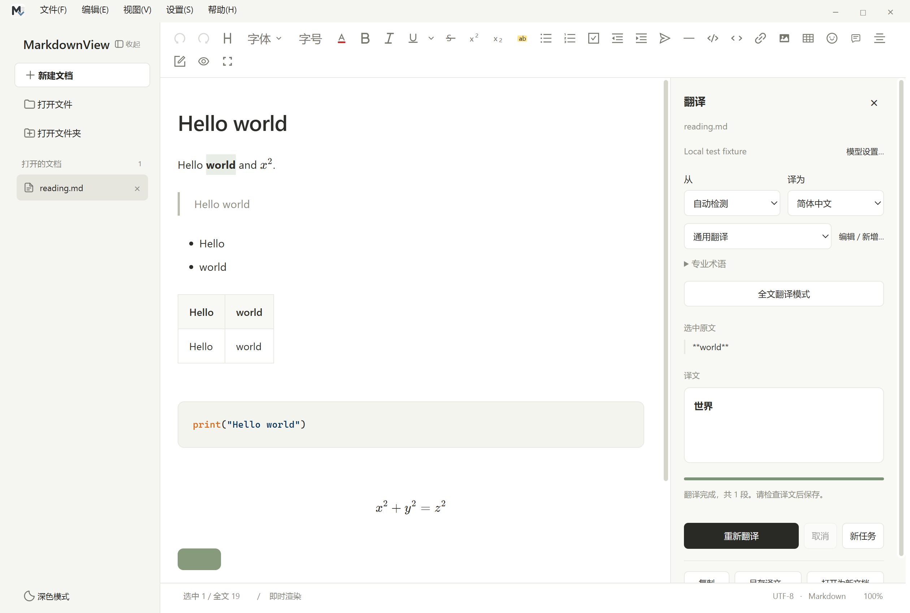
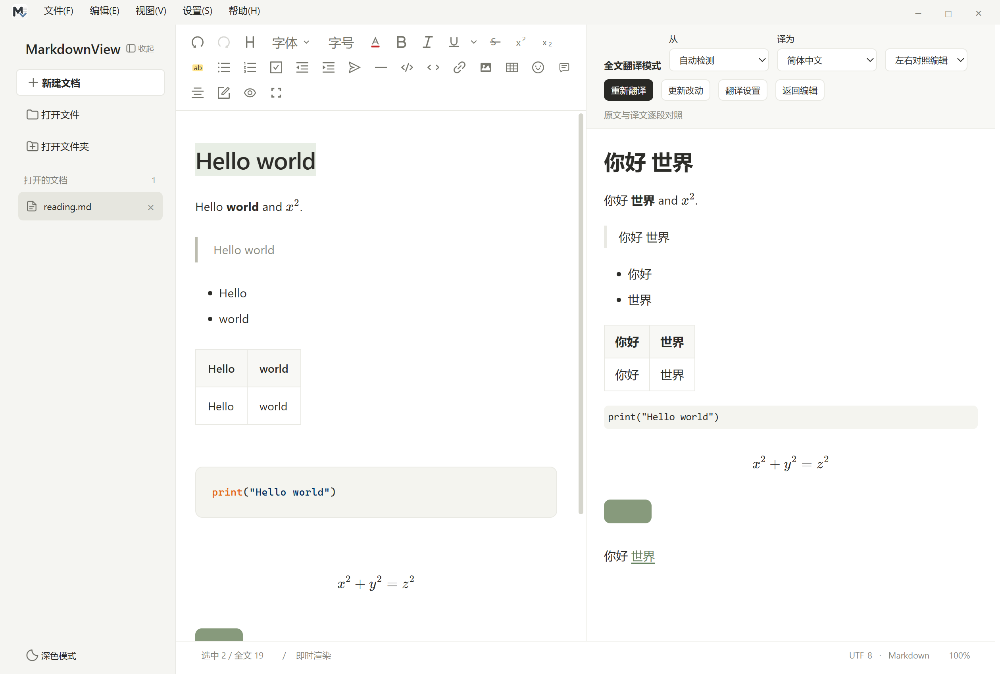
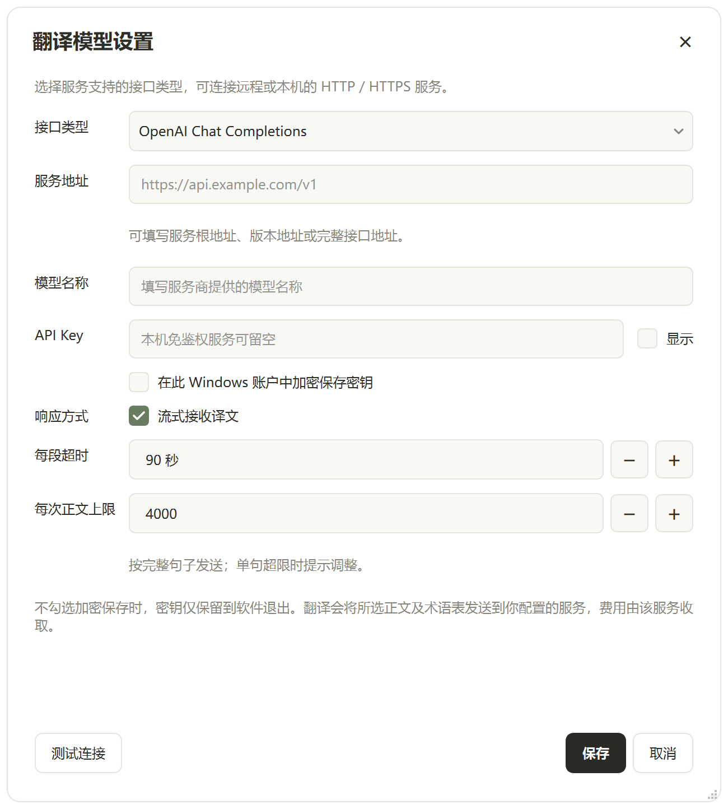
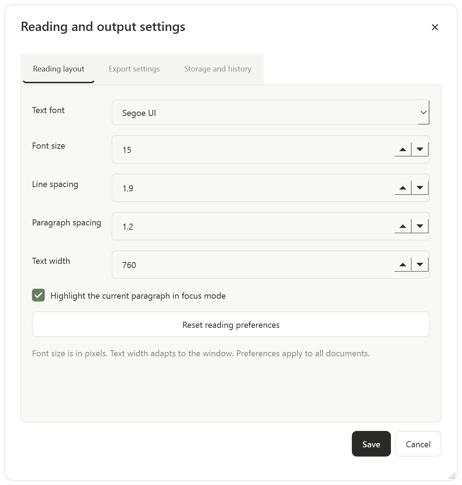

# MarkdownView 1.3：侧栏翻译、双语阅读与本地文档工具

保留 1.2 的 15 项本地文档功能和用户自接模型能力，1.3 将翻译放进编辑页面的右侧栏，新增全文对照阅读，并统一应用弹窗。继续使用现有 Qt、Vditor、KaTeX 和 Pandoc；没有增加模型 SDK、内置模型或字体包。

顶部编辑工具栏取消分组边框和容器，按钮按可用宽度逐个换行，避免整组挤到下一行。已检查 1320、860 和 480 像素宽度下的排列与按钮可达性。

## 翻译与专业提示词

1. 打开 **设置 → 翻译模型设置**，选择接口类型，填写服务地址、模型名称和 API Key。
2. 点击“测试连接”；成功后保存。测试只发送固定测试消息，不发送文档。
3. 选中文字后**右键 → 翻译选中内容**，或使用 **编辑 → 翻译**（`Ctrl+Alt+T`）。译文出现在右侧栏，已配置模型时会自动开始；再次选择其他文字会更新这一栏。
4. 在右栏的“从／译为”下拉框中选择原文与目标语言，再选择提示词，可展开“专业术语”。原文默认“自动检测”；选择“其他语言…”可输入自定义语言名称。选好语言后点击“开始翻译”。修改提示词或术语后可点击“重新翻译”；失败或取消时可继续原任务，或点“新任务”调整其他参数。
5. 完成后可复制、另存为 Markdown，或打开为新的未保存文档。没有选区时进入全文模式。

翻译会保护图片和链接的引用键。`![asset]`、`[asset]`、`[asset][]` 等简写引用依赖显示标签查找定义，因此保留其原标签，避免翻译后失效；`[显示文字][asset]` 的显式引用仍可翻译显示文字。图片管理、另存及 ZIP 分享同样支持简写图片引用。



侧栏和全文顶部统一使用 **从／译为** 两个下拉框，移除重复的中英文快捷按钮，两处选择互相同步。共提供 30 种语言选项：简体中文、繁体中文、英语、日语、韩语、法语、德语、西班牙语、葡萄牙语、意大利语、俄语、乌克兰语、波兰语、捷克语、荷兰语、瑞典语、丹麦语、挪威语、芬兰语、希腊语、土耳其语、阿拉伯语、希伯来语、印地语、泰语、越南语、印尼语、马来语、罗马尼亚语、匈牙利语。原文语言另有“自动检测”；两边均支持“其他语言…”输入。旧设置中保存的自定义语言仍可正常显示。

更换语言会停止旧任务并准备新任务，**不会自动发送新翻译请求**；点击“开始翻译”再提交，避免分别调整原文与目标语言时重复消耗 Token。开始翻译后记住目标语言。界面显示名称随中英文界面切换，实际请求中的语言值保持一致。

本轮语言下拉框、实时显示、局部更新、开始／停止与同步滚动、界面和语言共 6 个测试脚本通过；回归日志见 `tmp/validation-languages/`，界面截图见 `tmp/translation-languages/`。验证使用本地模拟服务，检查请求参数与操作行为，不代表各语言的实际翻译质量。

### 全文翻译模式

使用 **编辑 → 全文翻译模式**（`Ctrl+Alt+Shift+T`），或点击右栏同名按钮。默认“左右对照编辑”：左侧保留可编辑的原文，右侧显示译文；也可以切换到只读的“双语对照”“只看译文”“只看原文”。空间很窄时，编辑区和译文区改为上下排列。双语阅读中的代码、公式、图片等未变化内容只展示一次，表格和列表按完整区块对照。

顶部主按钮随任务状态显示 **开始翻译 → 停止翻译 → 继续翻译**；停止会取消当前请求，保留已完成批次。继续时从尚未完成的批次开始，不重复提交已完成批次。全部完成后显示“重新翻译”；原文有改动时显示“开始翻译”，提交改动内容。原有“更新改动”入口保持可用。

“左右对照编辑”支持**双向同步滚动**：滚动原文或译文时，另一侧按对应段落及段内进度跟随。源码模式、原文尚未更新或无法匹配区块时，按整篇阅读比例近似对齐。适用于页面缩放和窄窗口上下排列；退出对照编辑后停止联动。同步不移动编辑光标、不修改原文，也不产生模型请求。

勾选模型设置中的“流式接收译文”后，选区和全文都能**边接收边显示**，不必等待整个请求结束。当前生成部分先显示文字，每约 100 毫秒合并刷新；通过格式检查后再恢复完整 Markdown 和公式排版。流式标记不会显示给用户。服务本身必须支持流式返回；关闭流式或服务器一次性返回 JSON 时，界面无法提前显示尚未收到的文字。

右上角“翻译设置”可以展开／收起侧栏。“返回编辑”保留原有编辑状态和内容，并暂停尚未完成的网络请求；再次进入后可以继续。`Esc` 先收起侧栏，再退出全文阅读。批注和翻译共用右侧位置，每个标签页保留各自的任务。窄窗口侧栏浮在正文上方，可收起以完整阅读。



译文只用于阅读和单独输出，不直接写回原文。若模型输出仍导致区块数量或类型不一致，会退回整段原文／译文展示，避免错误配对。

截图中的文档和模型名称来自本地自动化测试，不代表真实模型的翻译质量。

`test_translation_controls.py` 在真实 WebEngine 中检查顶部开始／停止／继续、快速重复点击、已完成译文保留、双向段落定位、130% 缩放、文档首尾、源码模式比例定位、无滚动反馈循环及深浅主题／语言／窄窗口。与实时翻译、增量更新、界面和语言回归共 5 个相关脚本通过；截图与对齐记录见 `tmp/translation-controls/`，其余回归日志见 `tmp/validation-reader-controls/`。

### 手动更新改动，减少重复请求

首次全文翻译建立当前文档的句段对应关系。之后在左侧修改，右侧会提示“原文已修改”；**输入过程中不会自动发送新请求**。点击顶部 **更新改动** 后：

- 未改句段复用已有译文；只把新增或修改的句段提交给模型。连续变化会合并到长度受限的请求中，避免每句话重复发送提示词。
- 每次附带前后各最多两个完整句段的原文作为上下文，每侧最多 240 个字符；放不下的上下文省略，不截取半句。不会附带整份原文、整份译文或整段聊天历史。
- 删除句段、只改独立代码区块，以及没有实际内容变化的更新，在本地处理，不发翻译请求。
- 未修改译文在更新期间继续显示，待翻译部分有明确提示。若更新中再次编辑，会停止旧请求；下次手动更新使用最新原文，防止旧响应覆盖新修改。
- 切换服务、接口、模型、源语言、目标语言、提示词正文或术语表时，不复用此前译文。原文变化但尚未更新时，禁止将旧译文复制或导出为当前结果。

句段缓存只保留在当前文档会话的内存中；关闭文档或退出软件后需要重新建立。句段边界与请求字数上限无关，修改上限不会重新划分缓存。短上下文有利于减少输入，但跨章节术语、代词或叙述立场发生变化时，仍可能需要主动重译相关段落或全文。

本地 400 句样例中，修改一句只产生一个待翻译句段，另外 399 句复用；删除一句不产生请求。真实模型小样本将“20 摄氏度”改为“25 摄氏度”，只重译一句、复用其余四个句段，公式不变，单次局部更新约 1.53 秒。另一个本地服务样例的请求体从首次全文的 4,954 字符降为单句更新的 1,199 字符；这些是字符数，不是计费 Token 数。固定提示词、格式保护及上下文仍有成本，实际节省量取决于文档和模型。

### 完整句子分批发送

模型设置中的 **每次正文上限** 默认 4,000 字符，可设为 1,000–32,000；希望请求更小时可设为 2,000。沿用已有设置，不自动修改用户保存的数值。上限包含 Markdown 保护标记；提示词、术语表和前后文另计，字符数不等于 Token 数。

选区翻译和全文翻译共用同一套本地分句规则：

- 先识别句子与 Markdown 区块，再将完整句段合并到上限以内。放不下的句子完整移入下一批。
- 正文中的单个换行视为句内空白；空行、标题、列表项和表格行保留区块边界。公式、代码和链接地址中的标点不参与分句。
- 处理常见中英文句末标点、闭合引号、括号、小数、版本号、人名首字母以及 `Dr.`、`e.g.`、`Fig.` 等缩写。歧义情况尽量保留在同一句段；这不是适用于所有语言、缩写和排版习惯的语义解析器。
- 单个完整句段若已超过上限，在发送请求前提示其序号、长度和上限；提高上限或合理调整原文分段后再翻译。不会硬切句子，也不会暗中扩大请求。
- 上下文只提供给模型参考，提示词明确要求仅翻译本批正文。实时流式显示和手动“更新改动”保持可用。

参考了 [沉浸式翻译提示词仓库](https://github.com/immersive-translate/prompts) 的多段上下文思路、[immersive-script](https://github.com/plateaukao/immersive-script) 的段落合批与缓存思路，以及 [pySBD](https://github.com/nipunsadvilkar/pySBD) 的规则分句思路。本项目使用自行编写的轻量规则，没有引入这些项目的库、模型或服务。沉浸式翻译所链接的仓库是提示词仓库，不是扩展的完整核心源码。

分段回归脚本 `test_translation_segments.py` 检查跨换行句子、缩写、小数、引号与括号、请求边界、单句超限时零请求、Markdown 原样还原、完整上下文和修改批量大小后的缓存复用。

本轮 8 个相关脚本通过，记录位于 `tmp/validation-segmentation/`。24.48 万字符的合成文档在本机分句与合批约 0.15 秒，正文批次均不超过设定的 2,000 字符，并逐字还原源文档；该基准仅测本地预处理，不包含网络或模型推理。

接口类型支持下列三种，均支持流式 SSE 和普通 JSON。应选择服务器实际提供的接口；客户端支持某协议并不代表服务器也支持。

| 接口类型 | 路径 | 请求与认证 |
| --- | --- | --- |
| OpenAI Chat Completions | `/v1/chat/completions` | `messages`，Bearer API Key；旧配置默认使用此类型 |
| OpenAI Responses | `/v1/responses` | `instructions` + `input`，Bearer API Key；设置 `store: false` |
| Anthropic Messages | `/v1/messages` | `system` + `messages` + `max_tokens`，`x-api-key` 和 `anthropic-version` |

远程和本机地址均允许 **HTTP / HTTPS**。可以填写根地址、版本地址或完整接口地址，设置页会显示实际请求路径；切换类型时自动替换识别出的接口后缀。HTTP 按用户所填地址直接连接，不会强制转换为 HTTPS；其传输本身不加密。重定向仍需填写最终地址，不自动携带密钥跳转。

内置“通用翻译、学术论文、技术文档、商务沟通、自然易读”五个提示词。点击 **编辑 / 新增** 可以：

- 保持名称并保存，修改该预设；改用新名称，新增自己的专业提示词。
- 在提示词中使用 `{source_language}`、`{target_language}`；实际请求时自动替换语言。
- 删除自定义提示词，或恢复内置预设。提示词上限 12,000 字符。
- 使用每行 `原词 = 译词` 的术语表，最多 4,000 字符。提示词和术语表作为模型要求，具体遵循程度取决于模型。

提示词配置保存在本地；密钥不传入网页编辑器。默认仅在本次运行中保留密钥，退出后重新填写。可选择使用 Windows DPAPI 加密保存，绑定当前 Windows 账户；软件不会把明文密钥写入设置。更改服务主机时清空原密钥，避免误发给另一个服务。

每个请求使用操作当时的文档快照，全文修改由“更新改动”显式同步。选区和全文实时预览每 100 毫秒合并刷新，仅传递当前生成部分；不会在每次增量到达时重排整篇文档或重复渲染公式。后台标签页不重复刷新阅读内容；完成并关闭翻译界面的页面仍可由阅读缓存释放，回到标签页后恢复结果。网络通过 Qt 异步接口进行。保存译文时不能选原文件路径，打开译文也会创建新文档。

长文默认按约 4,000 个受保护文本字符分段，单次只发一个请求，支持 **1,000–32,000 字符**。每段超时可设为 **10–3,600 秒**。这两项使用独立的“− / +”按钮，也能直接输入或用键盘上下键修改。Anthropic Messages 另有“最大输出 Token 数”，默认 8,192，需符合所选服务和模型的限制。

模型设置的“测试连接、保存、取消”和连接结果固定在底部；窗口变小时仅参数区域滚动。



取消或失败时保留已完成段落，继续翻译只重试尚未完成的段落；需要修改分段长度或翻译范围时使用“新任务”。未完成译文的打开和保存按钮会明确标注“已完成部分”，不会将它显示为整篇翻译完成。

### 弹窗与主题

模型设置、提示词编辑、阅读／导出／资源设置、搜索、命令面板、模板、历史比较、图片管理和草稿恢复使用统一的圆角边框、标题栏、控件与按钮配色。支持标题栏拖动、右下角调整大小和 `Esc` 关闭；内容超出屏幕时可滚动。保存确认、导出完成提示继续使用同一套中性色系。通用消息框、名称输入框和文件选择器也跟随应用深浅主题，文件选择器采用 Qt 界面。

代码、数学公式、图片、链接目的地、HTML 标记和主要 Markdown 结构在本地替换为随机保护标记；返回后检查标记顺序和数量，再恢复原内容。批注的应用元数据不加入翻译正文。异常标记、截断、拒绝、空响应、连接失败和额度限制都会显示错误，不会静默保存有问题的当前段落。支持流式 SSE 和普通 JSON 响应；响应限制为 8 MiB，单次文档上限 500,000 字符，超出时需分次选择章节。

翻译质量、可用语言、耗时和费用由所接模型及服务决定。格式保护不等于语义正确性验证；建议核对专业术语、数字及上下文。三种协议使用本地模拟接口验证，并经用户授权测试了其 HTTP 服务的 Chat Completions 和 Anthropic Messages。该服务的 Responses 路径返回 404；没有把私人地址和密钥写入文档或源码。

## 15 项功能入口

| 功能 | 入口与行为 |
| --- | --- |
| 阅读排版设置 | **视图 → 阅读排版设置**：系统字体、字号、行距、段距、正文宽度；保存后应用到所有窗口和文档 |
| 只读阅读 | **视图 → 只读阅读模式**，`Ctrl+Shift+R`；锁定正文，保留选字、复制、查找、翻译和导出 |
| 项目全文搜索 | **编辑 → 项目全文搜索**，`Ctrl+Shift+F`；后台搜索已保存文件，显示文件、行号和片段，打开后在源码中选中对应行 |
| 快速打开 | **文件 → 快速打开文件**，`Ctrl+P`；筛选项目路径、文件名及已打开文档，未打开项目时也列出最近文件 |
| 外部修改对比与重载 | **文件 → 外部修改对比**；监听磁盘变化，暂停自动保存，并排或统一差异对照；可保留当前内容或重载磁盘版本 |
| 项目文件管理 | 文件树右键新建 Markdown / 文件夹、重命名文件、移动文件及资源管理器定位；更新打开文档的路径并迁移本地图片引用 |
| 恢复最近关闭文档 | **文件 → 恢复最近关闭的文档**，`Ctrl+Shift+T`；保留最近 10 个已保存文档的路径和阅读位置 |
| 历史版本 | **文件 → 历史版本**；比较快照并恢复为新文档，避免覆盖当前内容 |
| PDF 导出设置 | **设置 → PDF / Word 导出设置**；A4、A5、Letter、Legal，横纵向、5–40 mm 边距、页码和目录 |
| Word 导出模板 | 同一设置页选择 `.docx` 样式参考；使用其标题、正文、表格及页面样式，留空恢复默认；不会把模板正文当作封面插入 |
| 图片管理 | **文件 → 图片管理与打包**；列出本地、远程 / 内嵌与失效引用，定位本地文件，ZIP 打包 Markdown 与本地图片 |
| 专注写作 | **视图 → 专注写作模式**，`Ctrl+Shift+Enter`；收起侧栏和工具栏，可选突出当前段落，`Esc` 退出 |
| 命令面板 | **编辑 → 命令面板**，`Ctrl+Shift+P`；按名称查找当前可用操作，也可切换三种编辑模式 |
| 模板与片段 | **文件 → 从模板新建** / **编辑 → 插入常用片段**；会议、科研、实验、项目计划及公式、表格、代码、待办等；支持编辑和保存自定义内容 |
| 大文档轻量模式 | **视图 → 大文档轻量模式**；源码编辑，避免实时公式渲染，统计刷新从 150 ms 调整至 1,500 ms；默认超过 1 MB 自动使用，可在设置中关闭自动切换 |



外部重载前，未保存的当前内容会保留为独立文档，也会尝试写入历史。选择保留当前内容时，会备份磁盘版本，并继续暂停自动保存；用户下一次手动保存才会写回磁盘。比较期间磁盘再次变化时要求重新比较。被明确丢弃的未保存新文档不加入“最近关闭”，草稿恢复继续独立工作。

历史快照默认最多 **每个文档 20 份、合计 50 MB**。可在“资源与历史设置”中设置 0–500 MB；0 会禁用并清理历史。自动保存的历史最多每分钟记录一次。快照只包含 Markdown，不复制每个历史时点的图片二进制文件；被删除或替换的旧图片不能仅靠 Markdown 快照恢复。

项目搜索按需启动后台扫描，不建立常驻索引。跳过 `.git`、虚拟环境、依赖和构建目录，不递归链接目录；单文件上限 2 MB，每次最多扫描 20,000 个文件 / 100 MiB 文本并显示 1,000 条结果，触及上限会明确提示。搜索针对磁盘文件，未保存的编辑可能与片段不同。

图片压缩默认关闭，可在“资源与历史设置”中开启并设置最长边和 JPEG 质量；只在结果更小时采用压缩。透明位图保留透明度，SVG 和动画图片保持原始文件。本地图片随译文、另存为及打包迁移，网络图片不自动下载；失效路径会在图片管理中显示。

Word 转换与 ZIP 打包放到后台。PDF 从独立快照渲染，使用当前正文与排版偏好，不依赖可见编辑模式，也不会改变原文、缩放或选区。输出先写临时文件，再替换目标；转换失败时保留旧文件，并清理临时资源。

## 局部字体、字号与文字颜色

选中一句、一段或表格单元格中的文字，点击顶部“字体”，搜索并选择电脑已安装的字体。常用字体优先显示，支持按“宋体”“微软雅黑”等中文名称搜索；“恢复正文字体”将选区设置为当前阅读排版中的正文字体。取消或按 `Esc` 不修改文档。

“字号”支持 **6–96 磅**、0.5 磅微调，以及五号、小四、四号等常用字号；“恢复正文字号”使用当前阅读设置的正文大小。“文字颜色”（带色条的 A）提供八种常用颜色、系统选色器和十六进制输入；“自动颜色”跟随深浅主题，打印时使用深色正文。字号与文字颜色均只修改选区，可在句子、一段或表格单元格中使用。

局部字体、字号和文字颜色使用 HTML `span` 样式保存在 Markdown 中，保存重开后保留，并支持撤销／重做及与加粗、下划线、高亮叠加。手动字色优先于高亮的自动对比色。Word 导出写入可编辑的字体、字号和颜色属性，PDF 保留显示效果；Word 的字号精度为半磅，恢复正文时从像素换算并取最近半磅。软件不附带额外字体包；在其他电脑打开 Word 文件时，需要安装对应字体。其他 Markdown 阅读器是否显示局部格式取决于其对 HTML 样式的支持。

## 表格编辑

点击顶部“插入表格”，填写行数（包含首行表头）和列数后插入；支持 1–100 行、1–50 列，三种编辑模式均可使用。按 `Esc` 或“取消”返回正文，不修改内容。

在即时渲染或所见即所得模式中，右键单元格即可在其上方／下方插入行、左侧／右侧插入列，或删除当前行／列。菜单还支持“选中整个表格”和“删除整个表格”；选中整表后按 `Delete` 或 `Backspace` 也可删除。所有结构修改均支持撤销／重做。删除表头会将下一行提升为表头，删除最后一行或最后一列会移除整表，并保留可继续输入的正文位置。

操作只更新当前表格，不重新载入全文；面板与右键菜单跟随深浅主题和界面语言，只读状态禁止修改。源码模式直接编辑 Markdown 表格内容，行列右键操作在上述两种可视编辑模式中使用。

## 验证

新增自动化脚本：

```powershell
.\.venv\Scripts\python.exe test_translation.py
.\.venv\Scripts\python.exe test_model_protocols.py
.\.venv\Scripts\python.exe test_model_settings.py
.\.venv\Scripts\python.exe test_translation_ui.py
.\.venv\Scripts\python.exe test_translation_streaming.py
.\.venv\Scripts\python.exe test_translation_incremental.py
.\.venv\Scripts\python.exe test_document_services.py
.\.venv\Scripts\python.exe test_workspace_features.py
.\.venv\Scripts\python.exe test_export_preferences.py
.\.venv\Scripts\python.exe test_table_editing.py
.\.venv\Scripts\python.exe test_font_formats.py
.\.venv\Scripts\python.exe test_text_styles.py
.\.venv\Scripts\python.exe test_export_text_styles.py
.\.venv\Scripts\python.exe test_review_performance.py
.\.venv\Scripts\python.exe test_project_scan_cancellation.py
.\.venv\Scripts\python.exe test_translation_references.py
```

覆盖 Markdown 标记及图片引用、本地模拟 SSE / JSON、错误及截断、取消续译、加密存储、界面事件循环、右侧翻译栏、逐段双语显示、公式／表格／图片、提示词、原文保护、标签页隔离、后台阅读缓存恢复、弹窗深浅主题和中英文、只读与专注、搜索定位、外部冲突、历史上限、文件移动、压缩、ZIP，以及三种编辑模式下的实际 PDF 和 Word 模板输出。上一阶段 1.3 的 28 个源码回归脚本通过，日志位于 `tmp/validation-1.3/`。

上一轮针对工具栏、HTTP、三种模型协议和设置窗口运行了 11 个相关脚本，最终均通过，日志与逐次结果位于 `tmp/validation-models/`。覆盖三种协议的认证、请求体、UTF-8 流式分片、结束事件、截断／拒绝、重试／取消，以及设置迁移、数字按钮、固定底栏和深浅主题。缩放鼠标测试曾出现偶发失败，带事件观测和原脚本复测均通过；保留首次失败日志以供后续排查，未据此宣称解决了缩放问题。

本轮实时显示、English 入口和手动增量翻译的 8 个相关脚本通过，整组记录位于 `tmp/validation-streaming/`。新增脚本在服务器尚未结束首段时检查真实界面中的文字增长、未改译文持续显示、不重复渲染公式；并检查句段缓存、400 句改单句、删除／插入／清空／恢复、代码区块、只读切换、生成中再编辑、生成中换语言、模型失效缓存和原文保护。真实模型的小样本请求结果保存在忽略提交的本地测试目录，不含密钥。

当前按要求暂缓生成新版安装包；安装器检查将在修改收尾后执行。

接口依据：[Chat Completions 协议示例](https://api-docs.deepseek.com/api/create-chat-completion/)、[OpenAI Responses](https://developers.openai.com/api/reference/python/resources/responses/methods/create)、[Responses 流式事件](https://developers.openai.com/api/docs/guides/streaming-responses)、[Anthropic Messages](https://platform.claude.com/docs/en/api/messages/create)、[Anthropic 流式事件](https://platform.claude.com/docs/en/build-with-claude/streaming)、[Qt 异步网络接口](https://doc.qt.io/qtforpython-6/PySide6/QtNetwork/QNetworkAccessManager.html)、[Windows DPAPI](https://learn.microsoft.com/en-us/windows/win32/api/dpapi/nf-dpapi-cryptprotectdata)、[Pandoc 样式参考](https://pandoc.org/MANUAL.html#option--reference-doc)。
